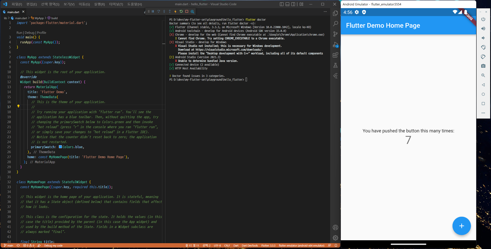

Scripts for `Flutter` toy creation on Windows




## Setup

* Run `install_update_all.ps1`


## PowerShell Scripts

* `ExecutionPolicy` should be set to `RemoteSigned` and unblock `ps1` files
```powershell
# Check
ExecutionPolicy
# Set as RemoteSigned
Set-ExecutionPolicy -Scope CurrentUser RemoteSigned

# Unblock ps1 files
Unblock-File *.ps1
```

* delete_all.cmd - Delete all installed
* console.cmd - Command prompt with the paths

* `install_update_all.ps1` - run all of below `ps1` files
    * dart_install_update.ps1 - Install dart-sdk
    * flutter_install_update.ps1 - Install flutter
    * openjdk_install_update.ps1 - Install jdk
    * sdkmanager_install_update.ps1 - Install sdkmanger cmdline-tools

* Vscode, Git
    * vscode_git_install_update.ps1 - Install vscode, git. Update vscode
        * vscode_checksum_fix.ps1 - For [webfont](https://github.com/Joungkyun/font-d2coding-ligature). <b>Do not run directly<b>
    * vscode_run.cmd - Run vscode


## Install android sdk, emulator

* Run `console.cmd` then run below commands with all licenses with `y`
```cmd
sdkmanager.bat --sdk_root=%cd%\sdk --licenses
sdkmanager.bat --sdk_root=%cd%\sdk --list
sdkmanager.bat --sdk_root=%cd%\sdk --install "platforms;android-33"
sdkmanager.bat --sdk_root=%cd%\sdk --install "build-tools;33.0.0"
sdkmanager.bat --sdk_root=%cd%\sdk --install "platform-tools"
sdkmanager.bat --sdk_root=%cd%\sdk --install "cmdline-tools;latest"
sdkmanager.bat --sdk_root=%cd%\sdk --install "emulator"
sdkmanager.bat --sdk_root=%cd%\sdk --install "system-images;android-33;google_apis_playstore;x86_64"
```


## Trouble shooting

* Emulator launch error when first vscode running
    * Run `flutter doctor --android-licenses` in any flutter project folder

* AMD cpu - Error `CPU acceleration status: GVM is not installed on this machine`
	* Install hypervisor driver from https://github.com/google/android-emulator-hypervisor-driver-for-amd-processors/releases

* `delete_all.cmd` not work - `flutter`, `sdk` folder are not deleted
	* Kill `adb.exe`, `java.exe` then delete again
